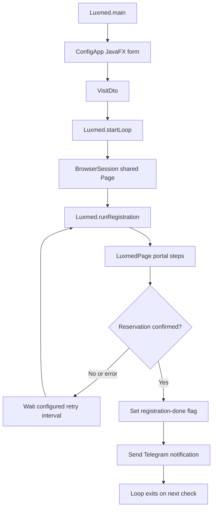

# Architecture

## Purpose

This is a Java desktop application that uses Playwright to automate appointment
booking in the Luxmed patient portal. A JavaFX setup window collects the visit
type, doctor name, and whether the appointment is a follow-up. The automation
then drives the portal, retrieves email verification codes through Gmail IMAP
when needed, and sends a Telegram notification after a reservation is confirmed.

The application interacts with real patient and appointment systems. Starting
the automation can submit a real booking; use it only with an authorized
account and verify the selected visit details.

## Component map

| Component | Responsibility |
| --- | --- |
| `src/main/java/org/example/Luxmed.java` | Application entry point, retry loop, and orchestration of each registration attempt. |
| `src/main/java/org/example/ui/ConfigApp.java` | JavaFX form for selecting the doctor type/name and follow-up flag; starts the automation thread. |
| `src/main/java/org/example/model/doctor/VisitDto.java` | Carries the selected visit options from the UI into the automation. |
| `src/main/java/org/example/model/doctor/DoctorType.java` | Maps visit types to UI labels, portal search text, filter input text, and doctor-list filenames. |
| `src/main/java/org/example/luxmed/LuxmedPage.java` | Playwright page object containing the portal navigation, questionnaire, search, and reservation steps. |
| `src/main/java/org/example/browser/BrowserSession.java` | Lazily creates and retains a shared browser, context, and page; closes them on JVM shutdown. |
| `src/main/java/org/example/browser/BrowserProvider.java` | Creates and closes Playwright Chromium; configures headless mode and optional local executable path. |
| `src/main/java/org/example/browser/BrowserUtils.java` | Saves timestamped screenshots under `playwright/screenshots/`. |
| `src/main/java/org/example/utils/ConfigReader.java` | Loads runtime properties and decrypts values wrapped as `ENC(...)`. |
| `src/main/java/org/example/utils/ConfigCrypto.java` | AES-GCM encryption/decryption helpers for individual configuration values. |
| `src/main/java/org/example/utils/MailReader.java` | Connects to Gmail IMAP, polls for new email, and extracts the MFA code. |
| `src/main/java/org/example/utils/Telegram.java` | Sends the booking-success notification. |
| `src/main/resources/doctors/*.txt` | Per-visit-type lists of doctor names displayed by the setup UI. |

`src/main/java/org/example/MailMain.java` and
`src/main/java/org/example/TelegramMain.java` are standalone integration
entry points. `src/main/java/org/example/Main.java` is not part of the booking
flow. `src/main/java/org/example/ConfigEncryptorMain.java` encrypts a single
config value for storage as `ENC(...)`.

## Runtime flow

`ConfigApp` launches the automation on a separate non-daemon thread before it
closes its window. `Luxmed.startLoop` obtains one `Page` from `BrowserSession`
and reuses it across attempts, retaining browser cookies/session state. Each
attempt creates a new `LuxmedPage` wrapper around that same page; it does not
create a fresh browser context. The configured retry maximum is used as the
inclusive upper bound of the loop (`i <= max`).

## Configuration and local setup

1. Copy `src/main/resources/config_default.properties` to
   `src/main/resources/config.properties`.
2. Fill in the Luxmed credentials, Gmail app-mail credentials, and Telegram
   credentials. The real config path is ignored by Git; never commit it or
   paste its values into documentation, issues, or chat.
3. Optional: wrap secrets as `ENC(...)`. Set `CONFIG_ENCRYPTION_KEY` in the
   process environment and use `ConfigEncryptorMain` to encrypt each value.
   The same environment variable must be set at runtime if the config contains
   encrypted values. This protects values at rest only when the key is kept
   separate from the config file.
4. If Playwright cannot use its managed Chromium download, set `is.proxy=true`
   and `browser.chrome.path` to a local Chromium executable. `browser.headless`
   controls whether the browser is visible.
5. Run commands from the repository root: `mvn compile` to compile and
   `mvn javafx:run` to open the setup form.

The config file is read from the relative path
`src\\main\\resources\\config.properties` during `ConfigReader` class
initialization, so running outside the repository root will not find it.
Configuration keys are defined in `config_default.properties` and consumed
through `ConfigReader`.

## Adding a doctor/visit type

1. Add an enum value to `DoctorType` with its display name, exact portal visit
   type text, filter input value, and doctor-list filename.
2. Add that names file under `src/main/resources/doctors/`. Blank lines and
   lines beginning with `#` are ignored.
3. Add or verify any type-specific questionnaire behavior in
   `LuxmedPage.partWithYesNoQuestionsAboutVisitType`.
4. Verify the search/filter values and flow against the live portal before
   relying on the new type. Existing locator text and some type-specific paths
   are based on observed UI behavior and may not cover every account state.

## Implementation notes and limitations

- `VisitDto` has additional clinic and time-filter fields, but the current
  booking UI does not expose them through `ConfigApp`, and the current
  `LuxmedPage` selection logic does not use those fields to choose a slot.
- Portal locators mostly depend on Polish UI text and markup. Portal changes
  can break the flow.
- Several steps use fixed sleeps, and some questionnaire paths are incomplete
  or conditional. See [Booking flow](booking-flow.md) for behavior and
  limitations.
- There is no `src/test` suite or configured linter in this repository.
- The Maven compiler properties state Java 21, while the compiler plugin is
  configured with source/target 19. Check both before relying on language
  features newer than Java 19.
